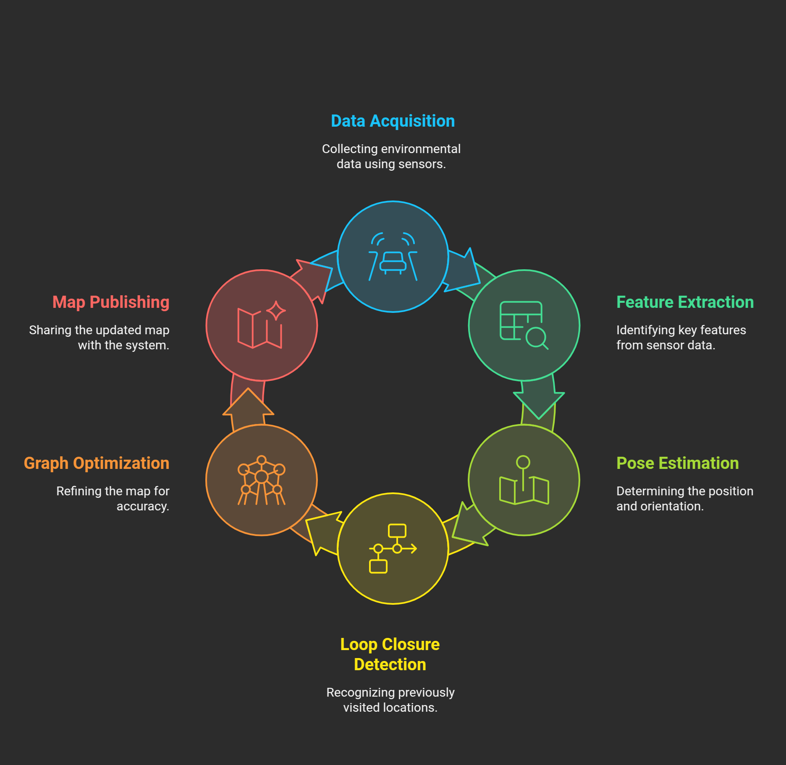
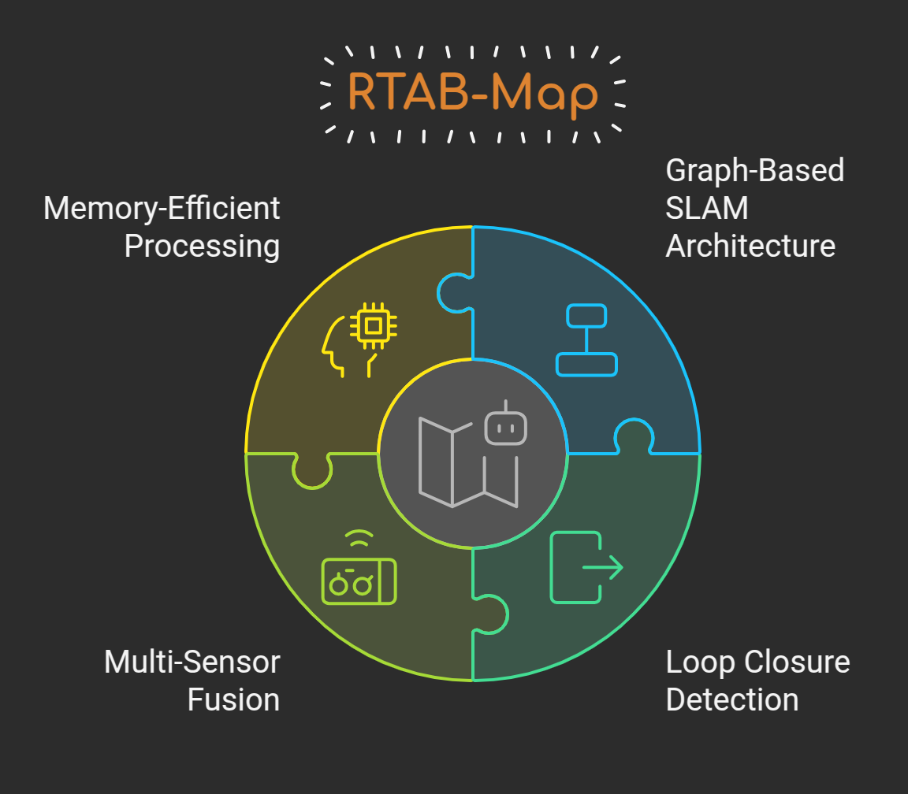
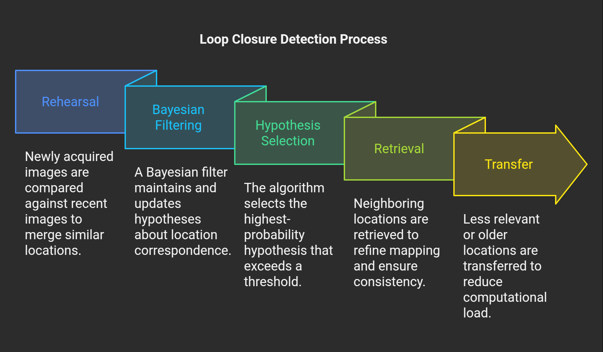

# Robot Localization with RTAB-Map

This repository provides a **localization approach** using **visual SLAM** with **RTAB-Map**. Unlike traditional methods that require **teleoperation before localization**, this system autonomously localizes the robot by constructing a detailed **3D map** of its environment. The implementation is compatible with both **Gazebo simulation environments** and **physical robot hardware**.

## Table of Contents

- [Overview](#overview)
- [RTAB-Map Technology](#rtab-map-technology)
  - [Core Features](#core-features)
  - [LiDAR Integration](#lidar-integration)
- [System Requirements](#system-requirements)
  - [Software Prerequisites](#software-prerequisites)
- [Installation](#installation)
  - [1. Set Up Your ROS 2 Workspace](#1-set-up-your-ros-2-workspace)
  - [2. Clone the Repository](#2-clone-the-repository)
  - [3. Install RTAB-Map ROS Package](#3-install-rtab-map-ros-package)
  - [4. Install Additional Dependencies](#4-install-additional-dependencies)
  - [5. Build the Workspace](#5-build-the-workspace)
- [Usage](#usage)
  - [Mapping Mode](#mapping-mode)
    - [1. Launch Mapping](#1-launch-mapping)
    - [2. Manually Drive the Robot for Proper Mapping](#2-manually-drive-the-robot-for-proper-mapping)
    - [3. Check for Loop Closure](#3-check-for-loop-closure)
  - [Localization Mode](#localization-mode)
    - [Launch Localization](#launch-localization)
- [System Architecture](#system-architecture)
- [Troubleshooting](#troubleshooting)
  - [Common Issues](#common-issues)
    - [Poor Localization Accuracy](#poor-localization-accuracy)
    - [High CPU/Memory Usage](#high-cpumemory-usage)
    - [Build Issues](#build-issues)
    - [Simulation Launch Failures](#simulation-launch-failures)
- [Additional Demo](#additional-demo)

---

## Overview

This project utilizes **RTAB-Map (Real-Time Appearance-Based Mapping)** to perform **visual SLAM** using an **RGB-D camera**. The implementation is enhanced by integrating **LiDAR sensors** to improve mapping accuracy and reliability.

This **multi-sensor approach** ensures robust performance in environments with:

- Varying lighting conditions
- Limited visual features
- Large-scale, complex environments



The system:

1. **Creates a detailed 3D map** of the environment.
2. **Uses that map for accurate localization** without manual teleoperation.

---
## 🔁 Loop Closure & RTAB-Map

To maintain **global consistency** and correct for **drift** over time, the system incorporates **loop closure detection** using [RTAB-Map](http://introlab.github.io/rtabmap/), a real-time appearance-based mapping library.

<p>
  
  
</p>

### 🔍 Loop Closure Detection

- Visual features are continuously extracted from incoming camera frames.
- When the system revisits a previously seen location, a **loop closure candidate** is detected.
- This results in a **new constraint** being added to the global pose graph, connecting the current pose to a past one.

### 🧠 RTAB-Map’s Role

- Operates in the background to ensure **real-time odometry isn’t disrupted**.
- Consumes data from both:
  - Visual-Inertial Odometry (VIO)
  - Lidar-based local submaps
- Performs:
  - **Visual loop closure detection**
  - **Pose graph optimization** using newly formed constraints

### ✅ Impact

- Reduces cumulative drift in large-scale mapping.
- Improves the global accuracy and consistency of the generated map.

---

### LiDAR Integration

While RTAB-Map primarily focuses on **visual SLAM**, our implementation integrates **LiDAR sensors** to:

- **Improve depth accuracy** in low-light conditions.
- **Enhance mapping in feature-poor environments** (e.g., plain walls).
- **Provide high-resolution point clouds** for precise localization.
- **Ensure robustness in dynamic environments**.

The fusion of **RGB-D and LiDAR data** is performed using **RTAB-Map’s multi-sensor registration**, creating a **more complete** and **accurate environmental map** than either sensor alone.

---

## System Requirements

### Software Prerequisites

- **ROS 2 Humble Hawksbill**
- **Navigation2 (Nav2) Stack**
- **Gazebo Classic** (Version 11.10.0 or newer)
- **RViz2**
- **RTAB-Map ROS Package** (Version 0.21.0 or newer)

---

## Installation

### 1. Set Up Your ROS 2 Workspace

```bash
mkdir -p ~/ros2_ws/src
cd ~/ros2_ws/src
```

### 2. Clone the Repository

```bash
git clone https://github.com/your-repo/autonomous-rtabmap.git
```

### 3. Install RTAB-Map ROS Package

```bash
sudo apt install ros-humble-rtabmap-ros
```

### 4. Install Additional Dependencies

```bash
rosdep install --from-paths src --ignore-src -r -y
```

### 5. Build the Workspace

```bash
cd ~/ros2_ws
colcon build
source install/setup.bash
```

---

## Usage

### Mapping Mode

#### 1. Launch Mapping

```bash
ros2 launch autonomous_rtabmap mapping_launch.py
```

#### 2. Manually Drive the Robot for Proper Mapping

Use keyboard teleoperation or an autonomous script.

#### 3. Check for Loop Closure

Use RViz2 to visualize loop closure detections and ensure map consistency.

### Localization Mode

#### Launch Localization

```bash
ros2 launch autonomous_rtabmap localization_launch.py
```

---

## System Architecture

> Add a system architecture diagram here showing ROS nodes and sensor data flow.

---

## Troubleshooting

### Common Issues

#### Poor Localization Accuracy
- Ensure sufficient visual features in the environment.
- Tune RTAB-Map parameters related to loop closure and keyframe insertion.

#### High CPU/Memory Usage
- Reduce the rate of image and point cloud processing.
- Use voxel grid filtering.

#### Build Issues
- Verify all dependencies are installed.
- Clean build: `colcon build --cmake-clean-cache`

#### Simulation Launch Failures
- Make sure Gazebo Classic is correctly installed.
- Check for missing plugin or world files.

---

## Additional Demo

> Include demo video or screenshots of successful localization and mapping.

